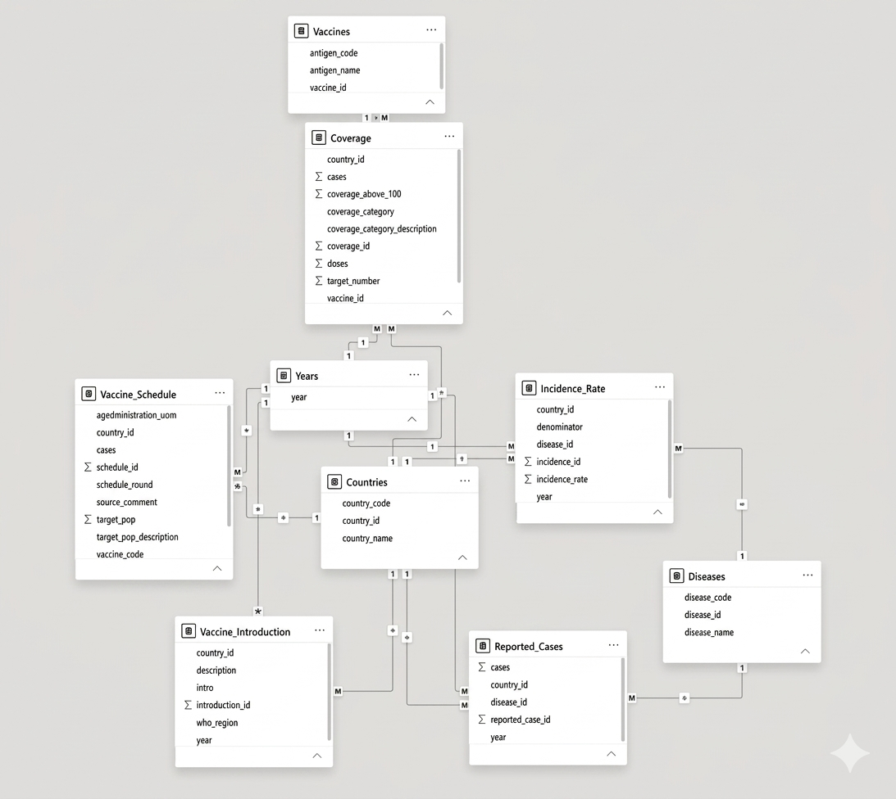
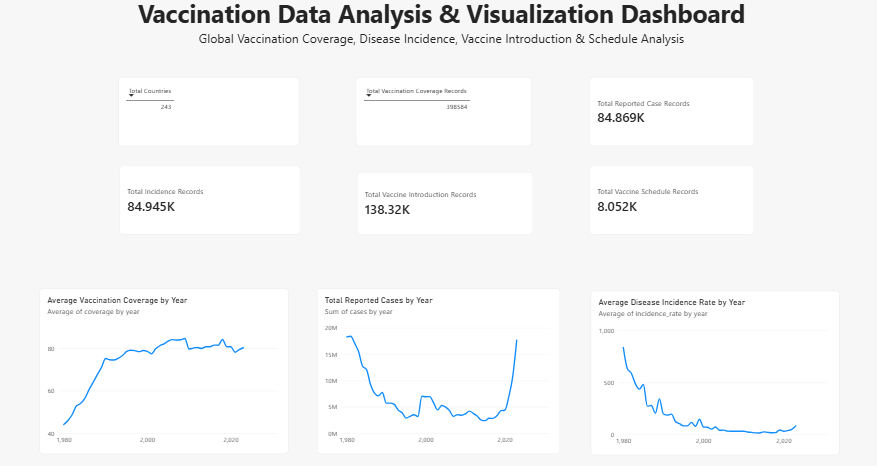
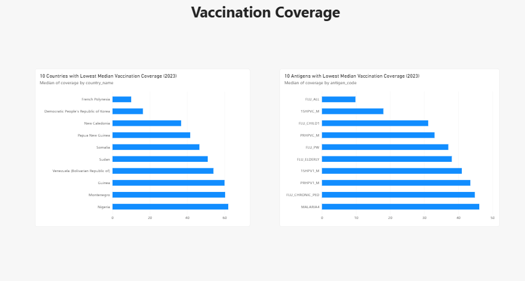
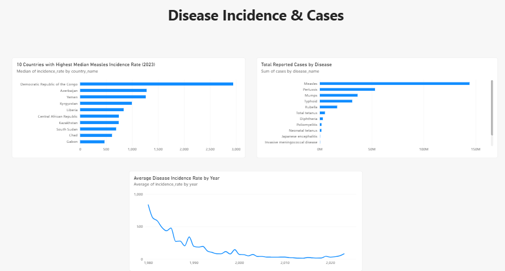
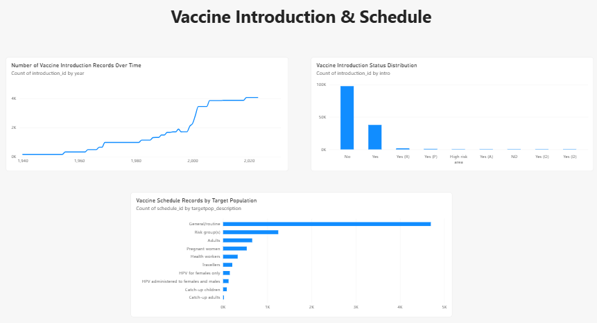
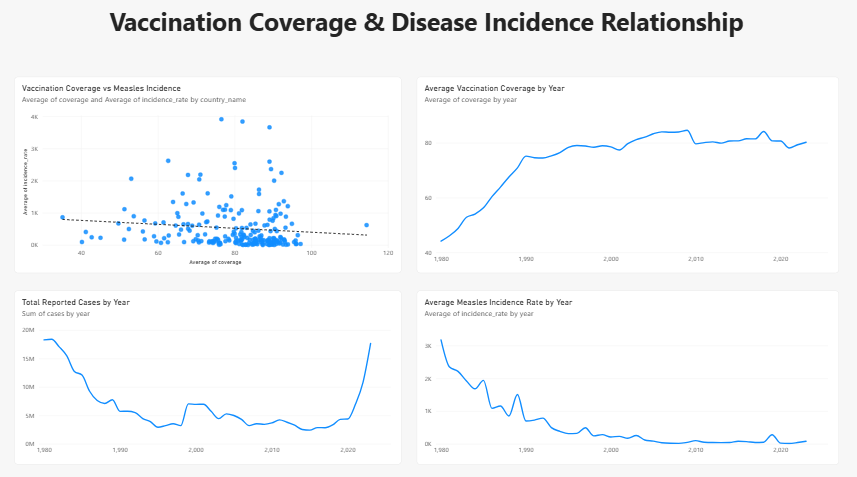
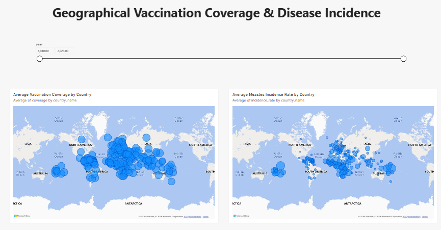

# 💉 Vaccination Data Analysis and Visualization

A healthcare data analytics project focused on analyzing global vaccination coverage, disease incidence, reported cases, vaccine introduction, and vaccination schedules using **Python, SQL, and Power BI**.

## 🚀 Project Overview

This project combines five vaccination-related datasets and follows an end-to-end analytics workflow:

**Data Loading → Data Cleaning → Exploratory Data Analysis → SQL Database → Power BI Dashboard**

The analysis focuses on vaccination coverage patterns, disease incidence trends, country-level differences, vaccine introduction patterns, and vaccination schedule information.

## 🎯 Problem Statement

Vaccination information is available across multiple datasets with different structures. Analyzing these datasets separately can make it difficult to understand vaccination coverage, disease outcomes, and vaccination-program patterns.

The objective of this project is to clean, organize, analyze, and visualize the data so that important patterns can be identified and presented through interactive dashboards.

The project can support:

- Public-health monitoring
- Disease prevention analysis
- Vaccination-program evaluation
- Resource planning
- Identification of areas requiring further investigation
- Data-driven health reporting

## 🚀 Features

✅ Data cleaning and preprocessing using Python

✅ Missing-value and duplicate analysis

✅ Invalid-value detection and handling

✅ Vaccination coverage analysis

✅ Disease incidence analysis

✅ Reported cases analysis

✅ Vaccine introduction trend analysis

✅ Vaccine schedule analysis

✅ Correlation analysis

✅ Normalized SQLite database

✅ Primary-key and foreign-key relationships

✅ SQL data integrity checks

✅ Interactive Power BI dashboards

## 📊 Datasets Used

### 1. Coverage Data

Contains vaccination coverage, target numbers, doses, vaccine antigens, countries, and years.

**Original size:** 399,859 rows × 11 columns

### 2. Incidence Rate Data

Contains disease incidence rates, denominators, diseases, countries, and years.

**Original size:** 84,946 rows × 8 columns

### 3. Reported Cases Data

Contains reported disease cases by country, disease, and year.

**Original size:** 84,870 rows × 7 columns

### 4. Vaccine Introduction Data

Contains vaccine introduction information by country, WHO region, year, and introduction status.

**Original size:** 138,321 rows × 6 columns

### 5. Vaccine Schedule Data

Contains vaccine schedules, target populations, geographical areas, administered ages, and schedule rounds.

**Original size:** 8,053 rows × 12 columns

## 🛠️ Technologies Used

| Technology | Purpose |
|---|---|
| Python | Data analysis and preprocessing |
| Pandas | Data manipulation |
| NumPy | Numerical processing |
| Matplotlib | Data visualization |
| Seaborn | Statistical visualization |
| SQLite | Relational database |
| SQL | Database design and integrity analysis |
| Power BI | Interactive dashboards |
| Google Colab | Python development and analysis |

## 🧹 Data Cleaning

The data-cleaning process included:

- Standardizing column names
- Standardizing year fields
- Removing metadata/footer records
- Checking exact duplicate rows
- Investigating missing values
- Detecting invalid negative dose values
- Flagging vaccination coverage values above 100%
- Preserving legitimate missing observations
- Checking data consistency before database creation

There were **no exact duplicate rows** in the five source datasets.

## 📈 Exploratory Data Analysis

The project includes:

- Vaccination coverage analysis
- Country-level vaccination coverage comparison
- Antigen-level vaccination coverage comparison
- Measles incidence analysis
- Reported cases analysis
- Vaccine introduction trends
- Vaccine schedule analysis
- Correlation analysis
- Correlation heatmaps
- Pair plots

A matched analysis of vaccination coverage and measles outcomes contained **7,943 country-year observations**.

The Pearson correlation between vaccination coverage and measles incidence rate was approximately **-0.229**. This indicates an inverse association in the analyzed observations, but it does not establish causation.

## 🗄️ SQL Database

A normalized SQLite relational database was created with the following main tables:

- Countries
- Years
- Diseases
- Vaccines
- Coverage
- Incidence_Rate
- Reported_Cases
- Vaccine_Introduction
- Vaccine_Schedule

Primary keys and foreign-key relationships were established between the relevant tables.

### 🔐 Foreign Key Integrity Check

The following integrity checks were performed in the project notebook. **All established relationships returned 0 orphan rows.**

| Relationship | Orphan Rows |
|---|---:|
| Coverage → Countries | 0 |
| Coverage → Years | 0 |
| Coverage → Vaccines | 0 |
| Incidence_Rate → Countries | 0 |
| Incidence_Rate → Diseases | 0 |
| Reported_Cases → Countries | 0 |
| Reported_Cases → Diseases | 0 |
| Vaccine_Introduction → Countries | 0 |
| Vaccine_Schedule → Countries | 0 |

This confirms that the implemented foreign-key relationships maintained referential integrity for the checked records.

## 🔗 SQL Database Relationship Model

The normalized vaccination database was connected to Power BI to verify and visualize the relationships between the SQL tables.

The model contains separate tables for countries, years, diseases, vaccines, vaccination coverage, disease incidence, reported cases, vaccine introduction, and vaccine schedules.

## 📊 Power BI Dashboard

Power BI was connected to the cleaned and normalized SQL database to create interactive dashboards for vaccination and disease analysis.

### 📌 Overview Dashboard

### 💉 Vaccination Coverage Dashboard

### 🦠 Disease Incidence & Cases Dashboard

### 💉 Vaccine Introduction & Schedule Dashboard

### 📈 Vaccination Coverage & Disease Incidence Relationship

### 🌍 Geographical Analysis

## 🔎 Key Findings

- Vaccination coverage varies substantially across countries and vaccine antigens.
- Measles incidence varies considerably between countries.
- The analyzed matched observations show an inverse association between vaccination coverage and measles incidence.
- Vaccine introduction records increased substantially over the long term, particularly after 2000.
- General/routine populations represent the largest target-population category in the analyzed vaccine schedule records.

## 🔮 Future Improvements

- Add more interactive Power BI filters and drill-through pages
- Automate database and dashboard refresh
- Expand country and regional comparative analysis
- Add scheduled reporting
- Develop a web-based version of the dashboard

## 👨‍💻 Author

**Mriganka Das**

**MCA Graduate | AI & Data Science Enthusiast**

GitHub: https://github.com/mrigankadas743442-cpu

The findings in this project are based on the available datasets and the analyses performed on them.

Observed correlations represent associations within the analyzed data and should not be interpreted as proof of causal relationships.
